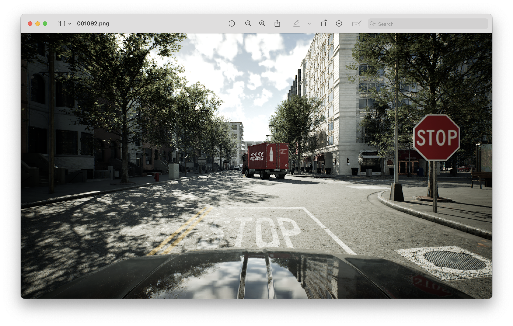

# CARLA-Seg

> **Synthetic Urban Scene Segmentation Dataset Generated with CARLA UE5**



[](LICENSE) 
[](https://carla.org)

---

## Table of Contents

1. [Overview](#overview)
2. [Dataset Structure](#dataset-structure)
3. [Annotation Format](#annotation-format)
4. [Statistics](#statistics)
5. [License](#license)
6. [Citation](#citation)
7. [Acknowledgements](#acknowledgements)

---

## Overview

**CARLA‑Seg** is a synthetic semantic‑segmentation dataset built with the latest **CARLA UE5** simulator. It targets *urban driving* research scenarios where collecting highly‑annotated real data is costly or impractical. The dataset offers:

* **8 680 RGB images** (7 232 train / 1 448 val) at **1280 × 720**.
* Pixel‑perfect masks for **9 classes** following a YOLOv11‑style segmentation format.
* Content generated from a **26‑hour continuous drive** in the *Upgraded Town 10* map with dynamic traffic (50 vehicles, 300 pedestrians) under daytime–sunny conditions.
* Realistic graphics via **Lumen** global illumination and **Nanite** geometry, narrowing the sim‑to‑real gap.

The goal is to provide a compact yet high‑quality benchmark for:

* Pre‑training and fine‑tuning semantic‑segmentation models.
* Synthetic‑to‑real domain‑adaptation studies.
* Rapid prototyping where real data is unavailable.

---

## Dataset Structure

```
CARLA-Seg/
├── train/
│   ├── images/           # 7 232 RGB frames (.png)
│   └── labels/           # YOLOv11 masks (.txt or .json)
├── val/
│   ├── images/           # 1 448 RGB frames
│   └── labels/
├── carlos_coco.yaml      # Class names & palette
├── examples/             # Example RGB + mask pairs
├── scripts/              # Data‑generation & analysis scripts
└── docs/                 # Figures, banner, paper, etc.
```

### Class List (`carlos_coco.yaml`)

| ID  | Name         |  Instances      |
| --- | ------------ | --------------- |
|  0  | car          | Yes             |
|  1  | motorcycle   | Yes             |
|  2  | bicycle      | Yes             |
|  3  | trafficlight | Yes             |
|  4  | bus          | Yes             |
|  5  | person       | Yes             |
|  6  | roads        | No              |
|  7  | sidewalks    | No              |
|  8  | trafficsigns | Yes             |

---

## Annotation Format

Masks follow **YOLOv11 segmentation** specs:

```
<class-index> <x1> <y1> <x2> <y2> ... <xn> <yn>.
```

---

## Statistics

* **Total objects:** 364 186 (train + val).
* **Avg objects / img:** 42.
* **Pixel coverage:** roads 19.5 % > sidewalks ≈1.7 % > cars ≈1.5 %.
* **Under‑represented class:** *bus* (≈0.28 % of instances) – consider class‑balancing techniques.

---

## License

The dataset and code are released under the **Creative Commons Attribution 4.0 International (CC BY 4.0)** license. You are free to share and adapt the material for any purpose, provided you give appropriate credit.

See [LICENSE](LICENSE) for details.

---

## Citation

If you use CARLA‑Seg in your research, please cite the accompanying paper:

```bibtex
@misc{ruiz2025carlaseg,
  title  = {CARLA‑Seg: A Synthetic Urban Scene Segmentation Dataset Generated with CARLA UE5},
  author = {Ruiz, Carlos},
  year   = {2025},
  howpublished = {Dataset on GitHub},
  url    = {https://github.com/IronDog421/CARLA-Seg},
  note   = {Version 1.0}
}
```

---

## Acknowledgements

* Developed with the open‑source **[CARLA Simulator](https://carla.org)**.

Feel free to open issues or pull requests. Contributions are welcome!
